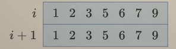

## 算法

[ref](https://space.bilibili.com/206214)

### 动态规划

动态规划可以通过回溯的dfs等式转换dp得到，**回溯本身可以不使用dfs等式**，因为回溯可以使用一个全局变量来替代返回值，但动态规划必须得有返回值

动态规划的dfs等式含义肯定是前i个或后i个，不会只代表第i个

#### 空间优化方式

```
dp[i+1][j]=dp[i][j]+dp[i][j-w[i]]
```

观察上述等式，发现只涉及i和i+1，可以简化成下式，其余几乎不需要变

```
dp[(i+1)%2][j]=dp[i%2][j]+dp[i%2][j-w[i]]
```

还可以进一步化简，作表

i行表示之前的返回值，i+1表示更新的返回值，而列上表示的是j，**当更新的值覆盖了原有值后，便无法再用到，如果后续还需要则必须专门用值来保存，或者换一个顺序来求值**，当`w[i]`为固定值时，可以用专门值保存，当不固定时，就需要倒序

假设`w[i]=2`求的`dp[i+1][j]`是下面的3，那么`dp[i][j]`是上面的3，`dp[i][j-w[i]]`是上面的1，所以可以算出更新值为4，覆盖原有的`dp[i][j]`



#### 进阶技巧

优化时间复杂度的技巧：

找到一个子问题，并将其两元素进行对调，如
`f[i]`表示以`nums[i]`结尾的LIS序列长度可以转化为`g[i]`表示长度为i+1的IS的末尾元素的最小值

### 回溯

回溯三问：当前操作、子问题、下一个子问题

其中下一个子问题是拆分子问题的问题，所以时间上算作是递进的，但是在数组中一般是往前走的，这是因为回溯的过程是递归的，动态规划的过程是递推的，为了让回溯转化成的动态规划是正向递推的，回溯就是反向进行的，但是**回溯在时间上也是正向的，在一步一步拆分原问题**

#### 递归和回溯区别

一、概念

递归：程序调用自身的编程技巧称为递归（recursion）。

回溯：回溯算法实际上一个类似枚举的搜索尝试过程，主要是在搜索尝试过程中寻找问题的解，当发现已不满足求解条件时，就“回溯”返回，尝试别的路径。

二、回溯和递归的区别

递归是一种算法结构，递归会出现在子程序中，形式上表现为直接或间接的自己调用自己；而回溯是一种算法思想，它是用递归实现的，回溯的过程类似于穷举法，但回溯有“剪枝”功能，即自我判断过程。

举个通俗的例子就是：

我们在路上走着，前面是一个多岔路口，因为我们并不知道应该走哪条路，所以我们需要尝试。尝试的过程就是一个函数。
如果我们选择了一个方向，后来发现又有一个多岔路口，这时候又需要进行一次选择。所以我们需要在上一次尝试结果的基础上，再做一次尝试，即在函数内部再调用一次函数，这就是递归的过程。

这样重复了若干次之后，发现这次选择的这条路走不通，这时候我们知道我们上一个路口选错了，所以我们要回到上一个路口重新选择其他路，这就是回溯的思想。

### 二分查找

理解二分，请牢记**区间**的定义！

区间内的数（下标）都是还未确定与 target 的大小关系的，有的是 < target，有的是 ≥ target；区间外的数（下标）都是确定与 target 的大小关系的。

跳出二分查找循环的条件是**区间为空**，故闭区间条件为left <= right 开区间条件是left+1 < right 左开右闭为left < right
闭区间变化为left=mid+1，因为mid已经检查过了，应在区间外

求等于target的第一个数，可以转换为求小于target的最后一个数的下一个数，反之亦然

我一般用开区间，也就是只要是指针指向的都是已经检查过的

### 数组不是单调的话，不要用滑动窗口，考虑用前缀和

### AVL 红黑树 B树 B+树

[ref](https://zhuanlan.zhihu.com/p/602681852)
[ref](https://zhuanlan.zhihu.com/p/93369069)

**红黑树**

- 每一个结点都有一个颜色，要么为红色，要么为黑色；
- 树的根结点为黑色；
- 树中不存在两个相邻的红色结点（即红色结点的父结点和孩子结点均不能是红色）；
- 从任意一个结点（包括根结点）到其任何后代 NULL 结点（默认是黑色的）的每条路径都具有相同数量的黑色结点。

红黑树就是牺牲一定平衡性,来提高插入,删除带来旋转操作性能

对于一颗有n个结点的红黑树而言，不论查找、删除、查找和最大值、最小值等等的时间复杂度都是O(log(n))

**AVL与红黑树比较**

- AVL比红黑树更平衡，高度差最多为1，红黑树不满足完全平衡二叉树
- 两者大多数性能差别不大，但当涉及到频繁的插入删除时，尤其是混合的插入删除时，红黑树性能完胜；当查找操作更频繁时，AVL树稍好

>红黑树在以任意序列插入或者删除混合进行的情况下，均摊复杂度依然保持在 O(1) 。而AVL树就惨了，可以证明存在精心构造出的特定操作序列，让它的均摊复杂度退化到 O(log(n))

**红黑树与B树比较**

- 在内存中时，红黑树修改的性能更好，因为B树是严格平衡的树，插入删除开销大
- B树在涉及到磁盘操作时完胜，因为每次查找只涉及一个树的节点，不会像红黑树一样将整棵树载入内存，并且红黑树是二叉树高度更高，不适合大量数据

**B树**

多路搜索树，通过多路来降低树的高度，如果无限路数则变成有序数组，那么就需要一次性读入

1. m阶B树(B树中所有结点的孩子结点最大值称为B树的阶)
2. 每个非叶子结点都包含m-1个数据元素和m个孩子节点
3. 每个叶子结点都包含m-1个数据元素

多用于文件索引，因为B树磁盘读取不需要一次性读入，每次加载一个节点，往下查找

>适用场景:
已经对红黑树高度比较深已经做了改进,通过增加节点内部元素数量,变成一个n叉树来解决,这个树高度大大降低,对于像数据库组件就可以考虑用来存储,从而提高检索性能了,io操作是个耗时操作,高度降低,io次数大大减少

>缺点:
全量数据还是保存在所有节点上,这样当节点大小固定时,一个节点存储的数据量并不多,依然可能导致树高度剧增.相比二叉树要好得多

**B+树**

B+树在B树的改造后产生，数据都在叶子节点，叶子节点之间加了双向指针形成链表

>适用场景:
相对于B树,有着更明显适用于数据库组件存储结构的特性,非叶子结点只存储检索关键字,大大提高了单个非叶子结点的数据量,从而进一步压缩树的高度,大大提高检索性能

**B树与B+树比较**

- 如果是数据库select多条数据的话，B 树需要做局部的中序遍历，可能要跨层访问。而 B+ 树由于所有数据都在叶子结点，不用跨层，同时由于有链表结构，只需要找到首尾，通过链表就能把所有数据取出来了。
- 由于B+树的内部节点只存放键，不存放值，因此，一次读取，可以在内存页中获取更多的键，有利于更快地缩小查找范围。
- B树可以在内部节点同时存储键和值，因此，把频繁访问的数据放在靠近根节点的地方将会大大提高热点数据的查询效率。这种特性使得B树在特定数据重复多次查询的场景中更加高效。


## go语言易错点

### range的赋值

```go
parent := make([]int, 5)
for i, p := range parent {
    p = i
}
```

错误在p是一个拷贝，除非是引用变量，否则不能够影响到原有变量